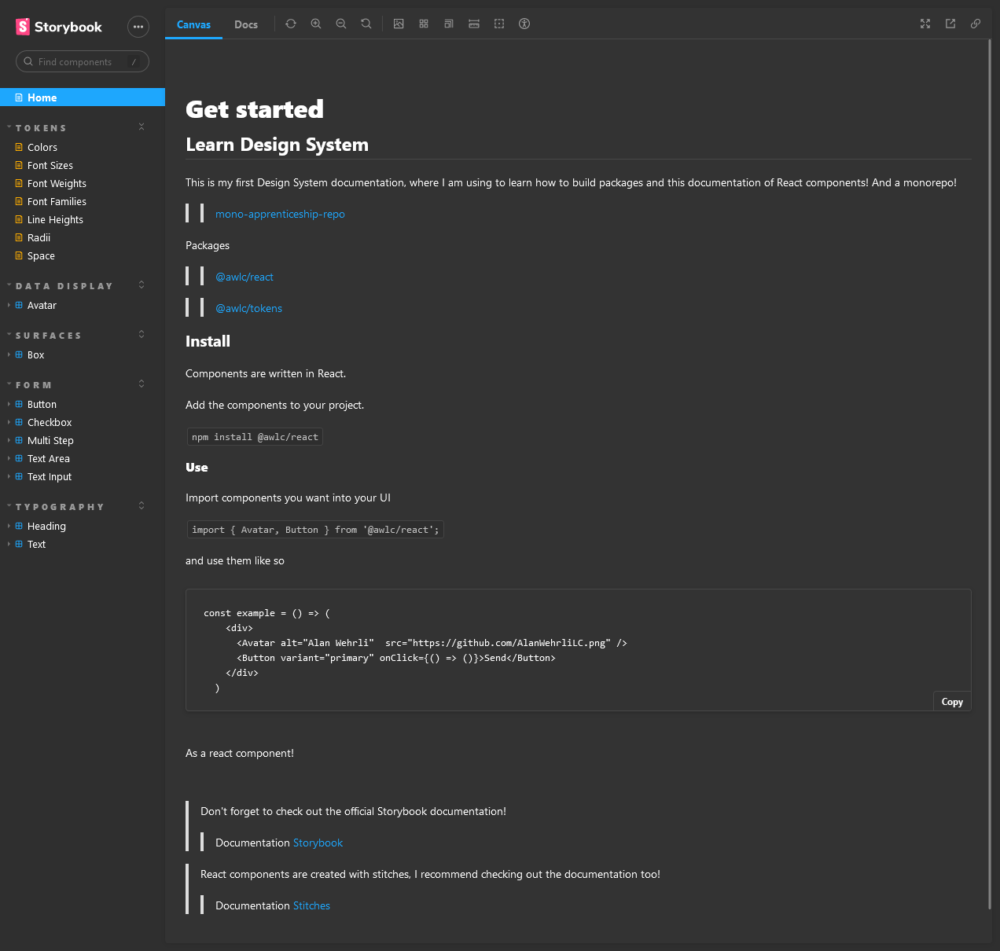

<a href="https://alanwehrlilc.github.io/mono-apprenticeship-repo/" target="_blank">
    <h1 align="center">Design System</h1>
</a>
<p align="center">Monorepo for learning package creation and Design System!</p>

<p align="center">This is my first Design System documentation, where I am using to learn how to build packages and this documentation of React components! And a monorepo!</p>

<h3 align="center">
  <a href="./LICENSE" target="_blank">
    
  </a>
</h3>

<p align="center">
    
</p>

<br />

# Techs

-  Tsup
-  React
-  Turbo
-  Radix UI
-  Typescript
-  Changesets
-  Stitches React
-  Phosphor React

## Installation of dependencies and local use

> Create somewhere on your pc, a folder to create a copy of the repository, inside it open command terminal and type the commands below:
```
git clone https://github.com/AlanWehrliLC/mono-apprenticeship-repo.git
cd mono-apprenticeship-repo
npm install
npm run dev
```

### Packages created from this monorepo!

>> [@awlc/react](https://www.npmjs.com/package/@awlc/react)

>> [@awlc/tokens](https://www.npmjs.com/package/@awlc/tokens)
